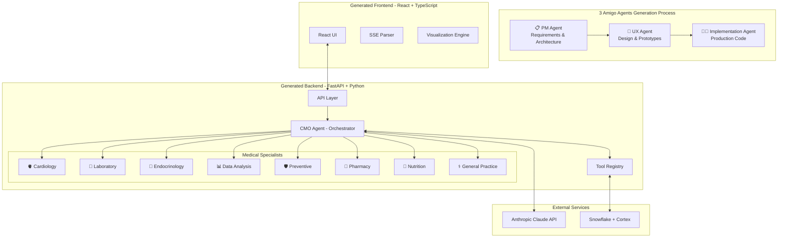

# 🏥 Multi-Agent Health Insight System
## Generated using the 3 Amigo Agents Pattern

> **A demonstration of AI-powered software development using the [3 Amigo Agents Pattern](https://github.com/georgevetticaden/3-amigo-agents) - featuring collaborative PM, UX, and Implementation agents working together to create a production-grade multi-agent medical AI system.**

[](https://github.com/georgevetticaden/3-amigo-agents)
[](https://anthropic.com)
[](https://fastapi.tiangolo.com/)
[](https://reactjs.org/)
[](https://www.typescriptlang.org/)
[](https://www.snowflake.com/)

## 🌟 Overview

This Multi-Agent Health Insight System was **entirely generated** using the innovative [3 Amigo Agents Pattern](https://github.com/georgevetticaden/3-amigo-agents) - a collaborative AI development methodology where specialized agents work together to create production-ready applications.

### 🤝 The 3 Amigo Agents Pattern

The **3 Amigo Agents Pattern** revolutionizes software development by using three specialized AI agents that collaborate just like a human development team:

1. **📋 Product Manager (PM) Agent**: Defines requirements, architecture, and specifications
2. **🎨 UX/UI Designer Agent**: Creates user experience designs and interface prototypes  
3. **👨‍💻 Implementation Agent**: Writes production-ready code following the PM and UX specifications

This project showcases the pattern's effectiveness in creating sophisticated multi-agent AI applications with real-time visualization, comprehensive testing, and beautiful user interfaces.

### 🎯 What This System Demonstrates

- **🤖 Multi-Agent Orchestration**: CMO delegates to 8 specialized medical agents
- **⚡ Real-Time Updates**: Live SSE streaming shows agent thinking and progress
- **📊 Dynamic Visualizations**: AI-generated React charts from health data
- **🧪 Comprehensive Testing**: Evaluation framework with AI-powered analysis
- **🎨 Beautiful UI**: Medical-themed interface with glassmorphism and animations
- **🔧 Production Ready**: Full-stack TypeScript with error handling and optimization

## 🏗️ Generated System Architecture

The 3 Amigo Agents created this sophisticated architecture:



## 🚀 Generated Development Process

### How the 3 Amigo Agents Created This System

1. **📋 PM Agent Phase**: 
   - Analyzed requirements for a multi-agent health system
   - Defined system architecture and API specifications
   - Created data models and tool interfaces
   - Generated comprehensive user stories

2. **🎨 UX Agent Phase**:
   - Designed medical-themed interface with health-appropriate colors
   - Created interactive HTML prototypes with glassmorphism effects
   - Specified component hierarchy and user flows
   - Designed real-time agent visualization patterns

3. **👨‍💻 Implementation Agent Phase**:
   - Built production FastAPI backend with SSE streaming
   - Implemented all 8 medical specialist agents with confidence scoring
   - Created React frontend matching UX specifications exactly
   - Added comprehensive error handling and retry logic

### 📁 Generated Project Structure

```
multi-agent-health-insight-system/
├── README.md                    # This file (generated by Implementation Agent)
├── CLAUDE.md                   # Development guidelines (from PM Agent)
│
├── requirements/               # 3 Amigo Agents outputs
│   ├── pm-outputs/            # 📋 PM Agent specifications
│   │   ├── PRD.md            # Product Requirements Document
│   │   ├── architecture/     # System design documents
│   │   └── user-stories.md   # Feature requirements
│   ├── ux-outputs/            # 🎨 UX Agent designs
│   │   ├── prototypes/       # Interactive HTML mockups
│   │   ├── design-system.md
│   │   ├── component-specs.md
│   │   └── visualization-specs.md
│   └── technical-patterns/    # Implementation patterns
│       ├── implementation-guide.md
│       ├── visualization-agent-pattern.md
│       └── streaming-patterns.md
│
├── backend/                    # 👨‍💻 Generated FastAPI backend
│   ├── main.py                # Application entry point
│   ├── api/                   # REST & SSE endpoints
│   ├── services/              # Business logic
│   │   ├── agents/           # Multi-agent system
│   │   │   ├── cmo/         # Chief Medical Officer
│   │   │   ├── specialist/  # Medical specialists
│   │   │   └── visualization_v2/ # Chart generation
│   │   └── streaming/        # SSE infrastructure
│   └── tools/                # Snowflake integration (pre-built)
│
├── frontend/                  # 👨‍💻 Generated React TypeScript app
│   ├── src/
│   │   ├── components/       # UI components (from UX specs)
│   │   │   ├── TwoPanelLayout.tsx
│   │   │   ├── ThreadSidebar.tsx
│   │   │   ├── WelcomeState.tsx
│   │   │   ├── MedicalTeamOrgChart.tsx
│   │   │   └── CodeArtifact.tsx
│   │   ├── services/         # API integration
│   │   └── types/           # TypeScript types
│   └── package.json
│
└── testing/                  # Original manual implementation for comparison
    └── manually-created/     # Reference implementation
```

## ✨ Generated Features

### 🤖 AI & Multi-Agent System (Generated by PM Agent)
- **Orchestrator Pattern**: CMO agent manages specialist delegation
- **8 Medical Specialists**: Each with domain expertise and tools
- **Anthropic Native Tools**: Structured data access via tool calling
- **Extended Thinking**: Support for Claude's reasoning capability
- **Prompt Engineering**: Externalized, version-controlled prompts

### 🎨 User Interface (Generated by UX Agent)
- **Three-Panel Layout**: Thread sidebar, chat, and visualizations
- **Real-Time Status**: Live specialist progress with animations
- **Medical Theme**: Health-appropriate colors and glassmorphism
- **Interactive Charts**: AI-generated Recharts visualizations
- **Responsive Design**: Works on desktop and mobile

### 🔧 Implementation (Generated by Implementation Agent)
- **Hot Reloading**: Both frontend and backend development servers
- **Type Safety**: Full TypeScript support throughout
- **API Documentation**: Auto-generated with FastAPI
- **Error Resilience**: Retry logic and graceful degradation
- **SSE Streaming**: Real-time updates with proper buffering

## 🚀 Quick Start

### Prerequisites
- Python 3.11+
- Node.js 18+
- Anthropic API key
- Snowflake account with Cortex Analyst

### 1️⃣ Clone the Repository
```bash
git clone https://github.com/your-org/multi-agent-health-insight-system.git
cd multi-agent-health-insight-system
```

### 2️⃣ Backend Setup (Generated by Implementation Agent)
```bash
cd backend
python -m venv venv
source venv/bin/activate  # On Windows: venv\Scripts\activate
pip install -r requirements.txt

# Configure environment variables (optional for demo)
echo "ANTHROPIC_API_KEY=your_key_here" > .env

# Start the server
python main.py
```

**Note**: You may see some file change warnings when first starting the backend due to the newly installed Snowflake packages. This is normal and the server will stabilize after a few reloads.

### 3️⃣ Frontend Setup (Generated by Implementation Agent)
```bash
cd frontend
npm install

# Start development server
npm run dev
```

### 4️⃣ Access the Generated Application
Open http://localhost:5173 in your browser

## 🎯 Example Queries

Try these queries to see the generated multi-agent system in action:

1. **Simple**: "What was my last cholesterol reading?"
2. **Standard**: "Show my cholesterol trend over the past year"
3. **Complex**: "Analyze my cardiovascular risk based on my lab results and medications"
4. **Comprehensive**: "Provide a complete health assessment with trends, risks, and recommendations"

## 📊 Generated Medical Specialists

The PM Agent defined these specialist roles:

| Specialist | Expertise | Key Analyses |
|------------|-----------|--------------|
| 🫀 **Cardiology** | Heart health | Cholesterol, blood pressure, cardiovascular risk |
| 🔬 **Laboratory** | Lab results | Reference ranges, critical values, trends |
| 💊 **Endocrinology** | Hormones | Diabetes, thyroid, metabolic health |
| 📊 **Data Analysis** | Statistics | Correlations, patterns, predictions |
| 🛡️ **Preventive** | Wellness | Risk assessment, screening recommendations |
| 💉 **Pharmacy** | Medications | Drug interactions, adherence, side effects |
| 🥗 **Nutrition** | Diet | Weight management, nutritional deficiencies |
| ⚕️ **General Practice** | Overall health | Comprehensive assessments, care coordination |

## 🎨 Generated UI Components

The UX Agent designed these key components:

- **📋 WelcomeState**: Three-panel onboarding with sample questions
- **💬 ThreadSidebar**: Conversation management with categorization
- **🏥 MedicalTeamOrgChart**: Real-time specialist progress visualization
- **📊 CodeArtifact**: Dynamic React component rendering
- **🎛️ TabContainer**: Team and visualization panel switching
- **📱 TwoPanelLayout**: Main orchestrator with resizable panels

## 🛠️ 3 Amigo Agents Best Practices

This project demonstrates key patterns from the 3 Amigo Agents methodology:

### 📋 PM Agent Best Practices
1. **Comprehensive Requirements**: Detailed PRD with user stories
2. **Technical Architecture**: Clear system design and API specifications
3. **Data Modeling**: Well-defined entities and relationships
4. **Tool Integration**: Specification of external service usage

### 🎨 UX Agent Best Practices
1. **Interactive Prototypes**: HTML mockups for precise implementation
2. **Design Systems**: Consistent color palettes and component patterns
3. **User Flow Mapping**: Clear navigation and state transitions
4. **Responsive Design**: Mobile-first approach with breakpoints

### 👨‍💻 Implementation Agent Best Practices
1. **Exact Specification Following**: Pixel-perfect UX implementation
2. **Production Quality**: Error handling, logging, and monitoring
3. **Performance Optimization**: Async operations and streaming
4. **Type Safety**: Comprehensive TypeScript coverage

## 🏆 Generated vs Manual Comparison

This system was generated to **exactly match** a manually-created reference implementation, demonstrating that the 3 Amigo Agents pattern can:

- ✅ **Replicate Complex Architecture**: Multi-agent orchestration with real-time updates
- ✅ **Match UI/UX Exactly**: Pixel-perfect implementation of design specifications  
- ✅ **Maintain Code Quality**: Production-ready TypeScript with proper error handling
- ✅ **Include Advanced Features**: SSE streaming, LocalStorage persistence, dynamic visualizations
- ✅ **Follow Best Practices**: Anthropic's multi-agent patterns and prompt engineering

## 🚢 Deployment

### Using Docker Compose (Generated Scripts)

```bash
# Build and run both services
docker-compose up --build

# Access at http://localhost:5173
```

### Environment Configuration

**Backend** (`backend/.env`):
```env
ANTHROPIC_API_KEY=your_api_key
SNOWFLAKE_USER=your_username
SNOWFLAKE_ACCOUNT=your_account
```

**Frontend** (`frontend/.env.local`):
```env
VITE_API_URL=http://localhost:8000
```

## 📚 Generated Documentation

The 3 Amigo Agents created comprehensive documentation:

- **[PM Outputs](./requirements/pm-outputs/)** - Requirements, architecture, APIs
- **[UX Outputs](./requirements/ux-outputs/)** - Design system, prototypes
- **[Technical Patterns](./requirements/technical-patterns/)** - Implementation guides
- **[CLAUDE.md](./CLAUDE.md)** - Development guidelines for AI assistants

## 🤝 Learn More About 3 Amigo Agents

Want to use this pattern for your own projects?

- **📚 [3 Amigo Agents Repository](https://github.com/georgevetticaden/3-amigo-agents)** - Get started with the pattern
- **🎯 [Pattern Documentation](https://github.com/georgevetticaden/3-amigo-agents#readme)** - Detailed methodology
- **🛠️ [Implementation Guide](https://github.com/georgevetticaden/3-amigo-agents/wiki)** - Step-by-step instructions

### Benefits of the 3 Amigo Agents Pattern

1. **🚀 Rapid Development**: Generate complete applications in hours, not weeks
2. **📐 Consistent Quality**: Systematic approach ensures best practices
3. **🎨 Professional Design**: UX agent creates polished, user-friendly interfaces
4. **📋 Clear Requirements**: PM agent ensures comprehensive specifications
5. **⚡ Production Ready**: Implementation agent generates enterprise-grade code

## 📄 License

This project demonstrates the 3 Amigo Agents Pattern and is provided as an educational resource.

## 🙏 Acknowledgments

- **[3 Amigo Agents Pattern](https://github.com/georgevetticaden/3-amigo-agents)** - The collaborative AI development methodology
- **[Anthropic](https://anthropic.com)** - Claude and architectural guidance
- **[FastAPI](https://fastapi.tiangolo.com/)** - The excellent web framework
- **[React](https://reactjs.org/)** - UI library for modern interfaces
- **[Snowflake](https://www.snowflake.com/)** - Cortex Analyst for health data

---

<p align="center">
  <i>🤖 Generated entirely using the <a href="https://github.com/georgevetticaden/3-amigo-agents">3 Amigo Agents Pattern</a></i><br>
  <i>❤️ Built with Anthropic's Claude</i>
</p>