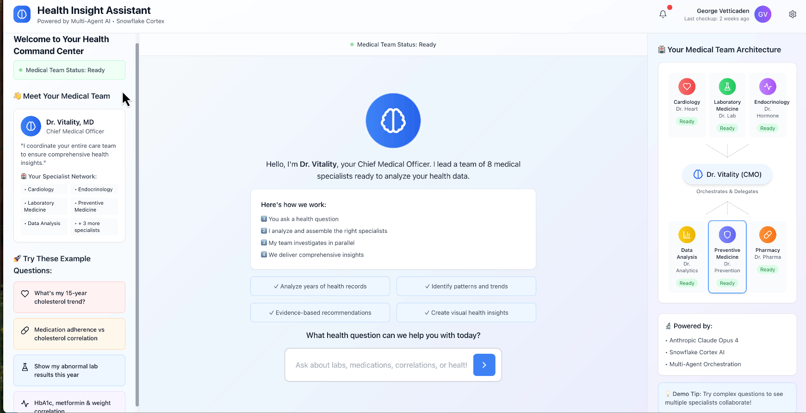
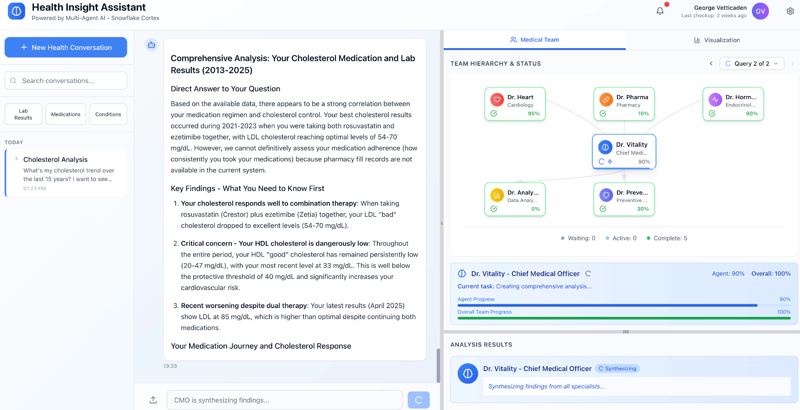
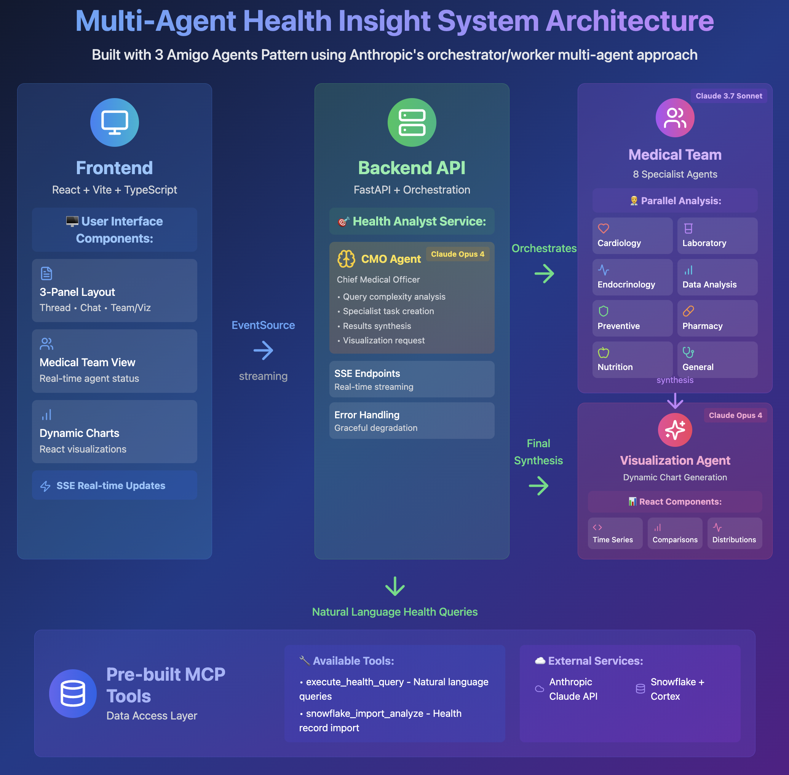
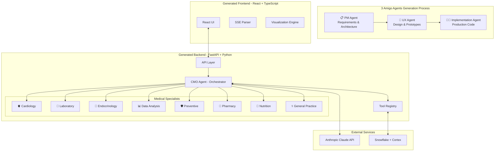

# 🏥 Multi-Agent Health Insight System
## Generated using the 3 Amigo Agents Pattern

> **A demonstration of AI-powered software development using the [3 Amigo Agents Pattern](https://github.com/georgevetticaden/3-amigo-agents) - featuring collaborative PM, UX, and Implementation agents working together to create a production-grade multi-agent medical AI system.**

[](https://github.com/georgevetticaden/3-amigo-agents)
[](https://anthropic.com)
[](https://fastapi.tiangolo.com/)
[](https://reactjs.org/)
[](https://www.typescriptlang.org/)
[](https://www.snowflake.com/)

## 🌟 Overview

This Multi-Agent Health Insight System was **entirely generated** using the innovative [3 Amigo Agents Pattern](https://github.com/georgevetticaden/3-amigo-agents) - a collaborative AI development methodology where specialized agents work together to create production-ready applications.

### 📸 System in Action

<p align="center">
  
  <br>
  <em>Welcome interface showcasing the three-panel layout with sample health queries</em>
</p>

<p align="center">
  
  <br>
  <em>Real-time multi-agent orchestration: CMO coordinates 8 medical specialists analyzing health data with live status updates</em>
</p>

### 🏗️ System Architecture

<p align="center">
  
  <br>
  <em>Complete system architecture: Frontend React components, FastAPI backend with multi-agent orchestration, and Snowflake data integration</em>
</p>

### 🤝 The 3 Amigo Agents Pattern

The **3 Amigo Agents Pattern** is a collaborative AI development methodology where three specialized agents work together like a development team:

1. **📋 Product Manager (PM) Agent**: Defines requirements, architecture, and specifications
2. **🎨 UX/UI Designer Agent**: Creates user experience designs and interface prototypes  
3. **👨‍💻 Implementation Agent**: Writes production-ready code following the PM and UX specifications

This project demonstrates how the pattern can create multi-agent AI applications with real-time visualization and responsive user interfaces.

### 🎯 What This System Demonstrates

- **🤖 Multi-Agent Orchestration**: CMO delegates to 8 specialized medical agents
- **⚡ Real-Time Updates**: Live SSE streaming shows agent thinking and progress
- **📊 Dynamic Visualizations**: AI-generated React charts from health data
- **🧪 Testing Framework**: Evaluation tools with automated analysis
- **🎨 Medical UI**: Health-themed interface with glassmorphism effects
- **🔧 Production Ready**: Full-stack TypeScript with error handling and optimization

## 🏗️ Generated System Architecture

The 3 Amigo Agents created this architecture:



## 🚀 Generated Development Process

### How the 3 Amigo Agents Created This System

1. **📋 PM Agent Phase**: 
   - Analyzed requirements for a multi-agent health system
   - Defined system architecture and API specifications
   - Created data models and tool interfaces
   - Generated comprehensive user stories

2. **🎨 UX Agent Phase**:
   - Designed medical-themed interface with health-appropriate colors
   - Created interactive HTML prototypes with glassmorphism effects
   - Specified component hierarchy and user flows
   - Designed real-time agent visualization patterns

3. **👨‍💻 Implementation Agent Phase**:
   - Built production FastAPI backend with SSE streaming
   - Implemented all 8 medical specialist agents with confidence scoring
   - Created React frontend matching UX specifications exactly
   - Added comprehensive error handling and retry logic

### 📁 Generated Project Structure

```
multi-agent-health-insight-system/
├── README.md                    # This file (generated by Implementation Agent)
├── CLAUDE.md                   # Development guidelines (from PM Agent)
│
├── requirements/               # 3 Amigo Agents outputs
│   ├── pm-outputs/            # 📋 PM Agent specifications
│   │   ├── PRD.md            # Product Requirements Document
│   │   ├── architecture/     # System design documents
│   │   └── user-stories.md   # Feature requirements
│   ├── ux-outputs/            # 🎨 UX Agent designs
│   │   ├── prototypes/       # Interactive HTML mockups
│   │   ├── design-system.md
│   │   ├── component-specs.md
│   │   └── visualization-specs.md
│   └── technical-patterns/    # Implementation patterns
│       ├── implementation-guide.md
│       ├── visualization-agent-pattern.md
│       └── streaming-patterns.md
│
├── backend/                    # 👨‍💻 Generated FastAPI backend
│   ├── main.py                # Application entry point
│   ├── api/                   # REST & SSE endpoints
│   ├── services/              # Business logic
│   │   ├── agents/           # Multi-agent system
│   │   │   ├── cmo/         # Chief Medical Officer
│   │   │   ├── specialist/  # Medical specialists
│   │   │   └── visualization_v2/ # Chart generation
│   │   └── streaming/        # SSE infrastructure
│   └── tools/                # Snowflake integration (pre-built)
│
├── frontend/                  # 👨‍💻 Generated React TypeScript app
│   ├── src/
│   │   ├── components/       # UI components (from UX specs)
│   │   │   ├── TwoPanelLayout.tsx
│   │   │   ├── ThreadSidebar.tsx
│   │   │   ├── WelcomeState.tsx
│   │   │   ├── MedicalTeamOrgChart.tsx
│   │   │   └── CodeArtifact.tsx
│   │   ├── services/         # API integration
│   │   └── types/           # TypeScript types
│   └── package.json
│
└── testing/                  # Original manual implementation for comparison
    └── manually-created/     # Reference implementation
```

## ✨ Generated Features

### 🤖 AI & Multi-Agent System (Generated by PM Agent)
- **Orchestrator Pattern**: CMO agent manages specialist delegation
- **8 Medical Specialists**: Each with domain expertise and tools
- **Anthropic Native Tools**: Structured data access via tool calling
- **Extended Thinking**: Support for Claude's reasoning capability
- **Prompt Engineering**: Externalized, version-controlled prompts

### 🎨 User Interface (Generated by UX Agent)
- **Three-Panel Layout**: Thread sidebar, chat, and visualizations
- **Real-Time Status**: Live specialist progress with animations
- **Medical Theme**: Health-appropriate colors and glassmorphism
- **Interactive Charts**: AI-generated Recharts visualizations
- **Responsive Design**: Works on desktop and mobile

### 🔧 Implementation (Generated by Implementation Agent)
- **Hot Reloading**: Both frontend and backend development servers
- **Type Safety**: Full TypeScript support throughout
- **API Documentation**: Auto-generated with FastAPI
- **Error Resilience**: Retry logic and graceful degradation
- **SSE Streaming**: Real-time updates with proper buffering

### 🔍 Execution Tracing (Generated by Implementation Agent)
- **Automatic Collection**: Every request traced without configuration
- **Dual Storage**: JSON for API access, HTML for offline viewing
- **Real-Time Access**: View traces while requests are processing
- **Performance Metrics**: Token usage, response times, bottlenecks
- **Debug Support**: Complete LLM conversations and tool calls

## 🚀 Quick Start

### Prerequisites
- Python 3.11+
- Node.js 18+
- Anthropic API key
- Snowflake account with Cortex Analyst

### 1️⃣ Clone the Repository
```bash
git clone https://github.com/your-org/multi-agent-health-insight-system.git
cd multi-agent-health-insight-system
```

### 2️⃣ Backend Setup (Generated by Implementation Agent)
```bash
cd backend
python -m venv venv
source venv/bin/activate  # On Windows: venv\Scripts\activate
pip install -r requirements.txt

# Configure environment variables (optional for demo)
echo "ANTHROPIC_API_KEY=your_key_here" > .env

# Start the server
python main.py
```

**Note**: You may see some file change warnings when first starting the backend due to the newly installed Snowflake packages. This is normal and the server will stabilize after a few reloads.

**Note**: The backend automatically enables execution tracing. Each health query will generate trace files in `backend/traces/`. You can view these traces through the API or by opening the HTML files directly.

### 3️⃣ Frontend Setup (Generated by Implementation Agent)
```bash
cd frontend
npm install

# Start development server
npm run dev
```

### 4️⃣ Access the Generated Application
Open http://localhost:5173 in your browser

## 🎯 Example Queries

Try these queries to see the generated multi-agent system in action:

1. **Simple**: "What was my last cholesterol reading?"
2. **Standard**: "Show my cholesterol trend over the past year"
3. **Complex**: "Analyze my cardiovascular risk based on my lab results and medications"
4. **Comprehensive**: "Provide a complete health assessment with trends, risks, and recommendations"

## 📊 Generated Medical Specialists

The PM Agent defined these specialist roles:

| Specialist | Expertise | Key Analyses |
|------------|-----------|--------------|
| 🫀 **Cardiology** | Heart health | Cholesterol, blood pressure, cardiovascular risk |
| 🔬 **Laboratory** | Lab results | Reference ranges, critical values, trends |
| 💊 **Endocrinology** | Hormones | Diabetes, thyroid, metabolic health |
| 📊 **Data Analysis** | Statistics | Correlations, patterns, predictions |
| 🛡️ **Preventive** | Wellness | Risk assessment, screening recommendations |
| 💉 **Pharmacy** | Medications | Drug interactions, adherence, side effects |
| 🥗 **Nutrition** | Diet | Weight management, nutritional deficiencies |
| ⚕️ **General Practice** | Overall health | Comprehensive assessments, care coordination |

## 🎨 Generated UI Components

The UX Agent designed these key components:

- **📋 WelcomeState**: Three-panel onboarding with sample questions
- **💬 ThreadSidebar**: Conversation management with categorization
- **🏥 MedicalTeamOrgChart**: Real-time specialist progress visualization
- **📊 CodeArtifact**: Dynamic React component rendering
- **🎛️ TabContainer**: Team and visualization panel switching
- **📱 TwoPanelLayout**: Main orchestrator with resizable panels

## 🛠️ 3 Amigo Agents Best Practices

This project demonstrates key patterns from the 3 Amigo Agents methodology:

### 📋 PM Agent Best Practices
1. **Comprehensive Requirements**: Detailed PRD with user stories
2. **Technical Architecture**: Clear system design and API specifications
3. **Data Modeling**: Well-defined entities and relationships
4. **Tool Integration**: Specification of external service usage

### 🎨 UX Agent Best Practices
1. **Interactive Prototypes**: HTML mockups for precise implementation
2. **Design Systems**: Consistent color palettes and component patterns
3. **User Flow Mapping**: Clear navigation and state transitions
4. **Responsive Design**: Mobile-first approach with breakpoints

### 👨‍💻 Implementation Agent Best Practices
1. **Exact Specification Following**: Pixel-perfect UX implementation
2. **Production Quality**: Error handling, logging, and monitoring
3. **Performance Optimization**: Async operations and streaming
4. **Type Safety**: Comprehensive TypeScript coverage

## 🏆 Generated vs Manual Comparison

This system was generated to **exactly match** a manually-created reference implementation, demonstrating that the 3 Amigo Agents pattern can:

- ✅ **Replicate Complex Architecture**: Multi-agent orchestration with real-time updates
- ✅ **Match UI/UX Exactly**: Pixel-perfect implementation of design specifications  
- ✅ **Maintain Code Quality**: Production-ready TypeScript with proper error handling
- ✅ **Include Advanced Features**: SSE streaming, LocalStorage persistence, dynamic visualizations
- ✅ **Follow Best Practices**: Anthropic's multi-agent patterns and prompt engineering

## 🚢 Deployment

### Using Docker Compose (Generated Scripts)

```bash
# Build and run both services
docker-compose up --build

# Access at http://localhost:5173
```

### Environment Configuration

**Backend** (`backend/.env`):
```env
ANTHROPIC_API_KEY=your_api_key
SNOWFLAKE_USER=your_username
SNOWFLAKE_ACCOUNT=your_account

# Tracing Configuration (optional - these are defaults)
ENABLE_TRACING=true
TRACE_STORAGE_PATH=./traces
TRACE_RETENTION_DAYS=30
TRACE_SAMPLING_RATE=1.0
```

**Frontend** (`frontend/.env.local`):
```env
VITE_API_URL=http://localhost:8000
```

## 📚 Generated Documentation

The 3 Amigo Agents created comprehensive documentation:

- **[PM Outputs](./requirements/pm-outputs/)** - Requirements, architecture, APIs
- **[UX Outputs](./requirements/ux-outputs/)** - Design system, prototypes
- **[Technical Patterns](./requirements/technical-patterns/)** - Implementation guides
- **[CLAUDE.md](./CLAUDE.md)** - Development guidelines for AI assistants

## 🧪 Evaluation Framework

The system includes a comprehensive evaluation framework implementing Anthropic's best practices for AI agent evaluation, with special support for multi-agent systems.

### 🎯 Evaluation Overview

The framework follows the **Analyze-Measure-Improve** lifecycle:

- **📋 Test Case Management**: QE Agent generates test cases from health queries
- **📏 5 Evaluation Dimensions**: Complexity, Specialists, Analysis, Tools, Structure
- **🤖 LLM-as-Judge**: Semantic evaluation for nuanced scoring
- **📊 Hybrid Scoring**: Combines deterministic and LLM-based evaluation
- **💡 Diagnostic Engine**: Provides actionable improvement recommendations

### 🏗️ Evaluation Architecture

```
/evaluation                    # Main evaluation framework
├── agents/                   # Agent evaluators
│   └── cmo/                 # CMO agent evaluation
│       ├── evaluator.py     # Core evaluation logic
│       ├── dimensions.py    # 5 evaluation dimensions
│       └── llm_judge.py     # LLM-as-Judge implementation
├── test_cases/              # Pre-defined test scenarios
└── reports/                 # HTML report generation

/backend/eval_integration     # Backend integration layer
├── subprocess_evaluator.py  # Runs evaluation in subprocess
├── cli_evaluator_adapter.py # Adapts traces for evaluation
├── trace_parser.py         # Extracts data from traces
└── mock_agents/            # Replay agents for evaluation
```

### 🚀 Using the Evaluation Framework

**1. Via Eval Development Studio (Web UI):**
```bash
# Run a health query
# Click "Create Test Case" after completion
# Use QE Agent to generate and refine test case
# Click "Run Evaluation" to see results
```

**2. Via Command Line:**
```bash
cd evaluation
python -m evaluation.cli evaluate-cmo \
  --test-cases test_cases/specialist_selection.json \
  --output-dir results/
```

**3. Via API:**
```python
POST /api/evaluation/run
{
  "test_case": {
    "query": "What are my recent lab results?",
    "expected_complexity": "SIMPLE",
    "expected_specialties": ["laboratory_medicine"]
  }
}
```

### 📊 Evaluation Dimensions

1. **Complexity Classification** (20%)
   - Correctly categorizes query complexity
   - SIMPLE → STANDARD → COMPLEX → COMPREHENSIVE

2. **Specialist Selection** (25%)
   - Precision: Right specialists selected
   - Recall: All needed specialists included
   - Rationale: Medical reasoning quality

3. **Analysis Quality** (25%)
   - Data gathering effectiveness
   - Context awareness
   - Comprehensive approach
   - Risk identification

4. **Tool Usage** (15%)
   - Appropriate tool selection
   - Success rate
   - Efficiency

5. **Response Structure** (15%)
   - Valid XML format
   - Complete specialist tasks
   - Error handling

### 🤖 LLM-as-Judge Features

The framework uses Claude to evaluate subjective aspects:

```python
# Example: Evaluating specialist selection rationale
"Rate how well the CMO justified each specialist selection..."
Score: 0.90
Reasoning: "Clear medical justification for each specialist..."
```

### 📈 Evaluation Reports

HTML reports include:
- **Overall Score**: Weighted average across dimensions
- **Dimension Breakdown**: Detailed scoring with components
- **Failure Analysis**: LLM Judge diagnosis of issues
- **Improvement Recommendations**: Specific fixes to implement
- **Trace Integration**: Links to full execution traces

### 🔄 Evaluation Lifecycle Events

During ~30 second evaluations, the system reports progress:

```javascript
// Poll for events during evaluation
GET /api/evaluation/events/{evaluation_id}

// Event types:
- 🔍 Loading execution trace
- 📋 Test case prepared
- 📊 Evaluating dimensions
- 🤖 LLM-as-Judge scoring
- 💡 Generating recommendations
- ✅ Evaluation complete
```

## 🔍 Execution Tracing and Debugging

The system includes comprehensive execution tracing capabilities for debugging and performance analysis across both production usage and evaluation framework testing.

### 🎯 Tracing Overview

The tracing system captures the entire execution sequence of multi-agent interactions:

- **🧠 LLM Interactions**: All prompts sent to Anthropic's Claude and their responses
- **🛠️ Tool Invocations**: Database queries, health data retrieval, and API calls
- **🏥 Agent Orchestration**: CMO task delegation and specialist coordination
- **📊 Performance Metrics**: Response times, token usage, and success rates
- **🔗 Event Relationships**: Parent-child relationships between operations

### **Default Behavior**

- **Tracing is ENABLED by default** for all production requests
- Every health query automatically generates a trace without any configuration
- Both JSON and HTML files are stored for each trace
- Traces are retained for 30 days by default (configurable)

### **Trace Storage**

Traces are stored in the filesystem with date-based organization:
```
backend/traces/
└── {YYYY-MM-DD}/
    ├── {trace_id}.json  # Raw trace data for API/analysis
    └── {trace_id}.html  # Standalone HTML viewer
```

**Key Features:**
- **Dual Format**: Both JSON (for API access) and HTML (for offline viewing)
- **Self-Contained HTML**: View traces without running the backend server
- **Date Organization**: Easy to find traces from specific days
- **Automatic Cleanup**: Old traces removed after retention period

### 📋 Trace Data Structure

Each trace contains:

```typescript
interface CompleteTrace {
  trace_id: string              // Unique identifier
  source: "evaluation" | "production"  // Context of execution
  start_time: string            // ISO timestamp
  end_time: string             // ISO timestamp
  total_duration_ms: number    // Total execution time
  initial_input: string        // User query
  events: TraceEvent[]         // Sequence of execution events
  summary: TraceSummary        // Aggregated statistics
  metadata: Record<string, any> // Additional context
}
```

### 🔧 Usage in Production

When users interact with the health insight system through the web interface:

1. **Automatic Trace Creation**: Every query creates a trace automatically
2. **Trace ID in Response**: The frontend receives the trace_id with results
3. **Real-Time Access**: View traces while the system is processing

**Example Frontend Integration:**
```typescript
// Traces are included in the streaming response
const response = await fetch('/api/chat/stream?message=' + encodeURIComponent(query));
const reader = response.body.getReader();

// Parse SSE events
while (true) {
  const { value, done } = await reader.read();
  const data = JSON.parse(new TextDecoder().decode(value));
  
  if (data.trace_id) {
    console.log(`Trace available at: /api/traces/${data.trace_id}/viewer`);
  }
}
```

### **Viewing Traces**

There are multiple ways to access traces:

1. **Via API Endpoint** (requires backend running):
   ```
   http://localhost:8000/api/traces/{trace_id}/viewer
   ```

2. **Direct File Access** (no backend needed):
   ```
   backend/traces/{YYYY-MM-DD}/{trace_id}.html
   ```

3. **Programmatic Access**:
   ```python
   # Get trace data
   GET /api/traces/{trace_id}
   
   # List traces with filters
   GET /api/traces/?user_id=123&limit=50
   ```

### 🌐 Trace Viewer Interface

The HTML trace viewer provides an interactive interface for exploring execution details:

<p align="center">
  <em>Interactive trace viewer showing LLM interactions, tool calls, and performance metrics</em>
</p>

**Features:**
- **📅 Timeline View**: Chronological sequence of all events
- **🏷️ Event Classification**: Color-coded by type
- **🔍 Interactive Exploration**: Expandable event details
- **📊 Summary Statistics**: Token usage, duration, operation counts
- **🎯 Context Awareness**: Agent types, stages, and metadata

**Event Types:**
- 🟦 **USER_QUERY**: Initial user input
- 🟩 **LLM_PROMPT**: Prompts sent to Claude
- 🟨 **LLM_RESPONSE**: Model responses with token usage
- 🟪 **TOOL_INVOCATION**: Health data queries
- 🟫 **TOOL_RESULT**: Query results
- 🟥 **ERROR**: Exceptions and failures

### ⚙️ Configuration

**Environment Variables:**
```bash
# Enable/disable tracing (default: true)
ENABLE_TRACING=true

# Storage backend: "filesystem" or "memory"
TRACE_STORAGE_TYPE=filesystem

# Storage path for filesystem backend
TRACE_STORAGE_PATH=./traces

# Retention period in days
TRACE_RETENTION_DAYS=30

# Sampling rate (0.0-1.0, default: 1.0 for 100%)
TRACE_SAMPLING_RATE=1.0
```

**Configuration Locations:**

1. **Default Settings**: `backend/services/tracing/__init__.py`
   - Contains default values for all tracing configuration
   - Can be overridden via environment variables

2. **Service Integration**: `backend/services/health_analyst_service.py`
   - Tracing is automatically enabled for all health queries
   - Can be disabled per-request if needed

### **Disabling Tracing**

To disable tracing for production:

1. **Via Environment Variable**:
   ```bash
   ENABLE_TRACING=false python main.py
   ```

2. **Via .env File**:
   ```env
   # backend/.env
   ENABLE_TRACING=false
   ```

3. **Programmatically** (for specific operations):
   ```python
   # Disable for specific service instance
   service = HealthAnalystService(enable_tracing=False)
   ```

### 🛠️ API Endpoints

**List Traces:**
```bash
GET /api/traces/
# Query params: source, user_id, session_id, limit, offset

# Example: Get last 10 production traces
GET /api/traces/?source=production&limit=10
```

**Get Specific Trace:**
```bash
GET /api/traces/{trace_id}
# Returns: Complete trace data in JSON format
```

**View Trace in Browser:**
```bash
GET /api/traces/{trace_id}/viewer
# Returns: Interactive HTML trace viewer (uses pre-generated HTML if available)
```

### 🎯 Common Use Cases

**🔍 Debugging User Issues:**
1. User reports unexpected results
2. Get their session_id or approximate timestamp
3. List traces: `/api/traces/?session_id={id}`
4. Open trace viewer to see exact LLM interactions
5. Identify issues in prompts or tool usage

**📈 Performance Optimization:**
1. Monitor trace completion times
2. Identify slow specialist agents
3. Analyze token usage patterns
4. Optimize prompts for efficiency

**🏥 Medical Team Analysis:**
1. Verify correct specialist selection
2. Analyze delegation patterns
3. Review tool call sequences
4. Validate medical reasoning

**🛡️ Security & Privacy:**
- Traces contain user queries and health data
- Follow your organization's data retention policies
- Consider reduced sampling rates for production
- Implement access controls for trace endpoints

### 📊 Trace Analytics

Use traces for system insights:

```python
# Example: Analyze average response times
from pathlib import Path
import json

traces_dir = Path("./traces")
response_times = []

for date_dir in traces_dir.iterdir():
    for trace_file in date_dir.glob("*.json"):
        with open(trace_file) as f:
            trace = json.load(f)
            response_times.append(trace["total_duration_ms"])

avg_time = sum(response_times) / len(response_times)
print(f"Average response time: {avg_time:.2f}ms")
```

### 🚀 Production Best Practices

1. **Sampling**: For high-traffic production, consider sampling:
   ```env
   TRACE_SAMPLING_RATE=0.1  # Trace 10% of requests
   ```

2. **Storage Management**: Monitor disk usage and adjust retention:
   ```env
   TRACE_RETENTION_DAYS=7  # Keep traces for 1 week
   ```

3. **Access Control**: Secure trace endpoints in production:
   ```python
   # Add authentication middleware to trace routes
   @router.get("/api/traces/{trace_id}")
   @requires_auth
   async def get_trace(trace_id: str, user: User = Depends(get_current_user)):
       # Verify user has access to this trace
   ```

4. **Monitoring**: Set up alerts for trace failures or performance degradation

This comprehensive tracing system enables deep visibility into the multi-agent health system's execution, supporting both development debugging and production monitoring with minimal overhead.

## 🤝 Learn More About 3 Amigo Agents

Want to use this pattern for your own projects?

- **📚 [3 Amigo Agents Repository](https://github.com/georgevetticaden/3-amigo-agents)** - Get started with the pattern
- **🎯 [Pattern Documentation](https://github.com/georgevetticaden/3-amigo-agents#readme)** - Detailed methodology
- **🛠️ [Implementation Guide](https://github.com/georgevetticaden/3-amigo-agents/wiki)** - Step-by-step instructions

### Benefits of the 3 Amigo Agents Pattern

1. **🚀 Faster Development**: Generate working applications quickly
2. **📐 Consistent Quality**: Systematic approach follows established patterns
3. **🎨 Professional Design**: UX agent creates clean, user-friendly interfaces
4. **📋 Clear Requirements**: PM agent provides detailed specifications
5. **⚡ Production Ready**: Implementation agent generates deployable code

## 📄 License

This project demonstrates the 3 Amigo Agents Pattern and is provided as an educational resource.

---

<p align="center">
  <i>🤖 Generated entirely using the <a href="https://github.com/georgevetticaden/3-amigo-agents">3 Amigo Agents Pattern</a></i><br>
  <i>❤️ Built with Anthropic's Claude</i>
</p>